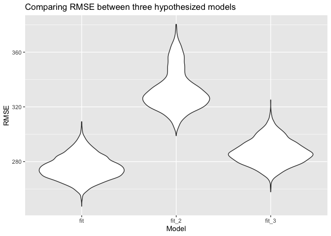

Homework 6
================
Troy Layouni

## Problem 1

-----

#### Part 1: Loading and cleaning `birthweight` dataset

  - Loading csv
  - cleaning variable types

<!-- end list -->

``` r
birthweight_df = 
  read_csv("./data/birthweight.csv") %>% 
  mutate(
    mrace = as.factor(mrace), 
    mrace = recode(mrace, "1" = "White", "2" = "Black", "3" = "Asian", "4" = "Puerto Rican", "8" = "Other", "9" = "Unknown"),
    frace = as.factor(frace), 
    frace = recode(frace, "1" = "White", "2" = "Black", "3" = "Asian", "4" = "Puerto Rican", "8" = "Other", "9" = "Unknown"),
    malform = as.factor(malform),
    malform = recode(malform, "1" = "absent", "2" = "absent"),
    babysex = as.factor(babysex),
    babysex = recode(babysex, "1" = "male", "2" = "female")
  )
```

    ## Parsed with column specification:
    ## cols(
    ##   .default = col_double()
    ## )

    ## See spec(...) for full column specifications.

#### Part 2: Building a linear model

First proposed linear model:

  - this model was created through a data-driven process, adding in
    variables one at a time, to see whether they were significant and
    whether the adjusted r-squared changed by an appreciable amount to
    determine whether the variable should be included in my regression
    model. gaweeks was always included as it is a key factor in an
    infant’s birthweight.

<!-- end list -->

``` r
birthweight_df = 
  birthweight_df %>% 
  mutate(
    mrace = fct_infreq(mrace)
  )

fit = lm(bwt ~ bhead + blength + delwt + mrace + gaweeks, data = birthweight_df)

summary(fit)
```

    ## 
    ## Call:
    ## lm(formula = bwt ~ bhead + blength + delwt + mrace + gaweeks, 
    ##     data = birthweight_df)
    ## 
    ## Residuals:
    ##      Min       1Q   Median       3Q      Max 
    ## -1093.28  -184.30    -2.72   175.43  2391.18 
    ## 
    ## Coefficients:
    ##                     Estimate Std. Error t value Pr(>|t|)    
    ## (Intercept)       -5870.8739    96.9590 -60.550  < 2e-16 ***
    ## bhead               131.7275     3.4447  38.241  < 2e-16 ***
    ## blength              77.0253     2.0329  37.889  < 2e-16 ***
    ## delwt                 2.1598     0.1973  10.945  < 2e-16 ***
    ## mraceBlack         -126.7723     8.9834 -14.112  < 2e-16 ***
    ## mracePuerto Rican  -102.5200    18.8393  -5.442 5.56e-08 ***
    ## mraceAsian          -51.5992    42.7804  -1.206    0.228    
    ## gaweeks              11.8719     1.4671   8.092 7.56e-16 ***
    ## ---
    ## Signif. codes:  0 '***' 0.001 '**' 0.01 '*' 0.05 '.' 0.1 ' ' 1
    ## 
    ## Residual standard error: 276.4 on 4334 degrees of freedom
    ## Multiple R-squared:  0.7092, Adjusted R-squared:  0.7087 
    ## F-statistic:  1510 on 7 and 4334 DF,  p-value: < 2.2e-16

#### Part 3: Plotting the residuals against the fitted values

``` r
birthweight_df %>% 
  modelr::add_residuals(fit) %>% 
  modelr::add_predictions(fit) %>% 
  ggplot(aes(x = pred, y = resid)) + 
  geom_point() + 
  labs(
    title = "Fitted Values for Birthweight Regression Model compared to Residuals",
    x = "Predicted Values",
    y = "Model Residuals"
  )
```

<!-- -->

#### Part 4: Comparing the hypothesized model to two additional models for birthweight using cross-validation

  - using `crossv_mc` and `purr` functions to compare prediction error
    between the three models

<!-- end list -->

``` r
cv_df = 
  crossv_mc(birthweight_df, 4342)

cv_df =
  cv_df %>% 
  mutate(
    train = map(train, as_tibble),
    test = map(test, as_tibble))
```

``` r
cv_df = 
  cv_df %>% 
  mutate(
    fit  = map(train, ~lm(bwt ~ bhead + blength + delwt + mrace + gaweeks, data = birthweight_df)),
         fit_2  = map(train, ~lm(bwt ~ gaweeks + blength, data = birthweight_df)),
         fit_3  = map(train, ~lm(bwt ~ bhead + babysex + blength + bhead * babysex * blength, data = birthweight_df)) 
  ) %>% 
  mutate(rmse_fit = map2_dbl(fit, test, ~rmse(model = .x, data = .y)),
         rmse_fit_2 = map2_dbl(fit_2, test, ~rmse(model = .x, data = .y)),
         rmse_fit_3 = map2_dbl(fit_3, test, ~rmse(model = .x, data = .y)))
```

##### Plotting and comparing RMSE between the three models

``` r
cv_df %>% 
  select(starts_with("rmse")) %>% 
  pivot_longer(
    everything(),
    names_to = "model", 
    values_to = "rmse",
    names_prefix = "rmse_") %>% 
  mutate(model = fct_inorder(model)) %>% 
  ggplot(aes(x = model, y = rmse)) + geom_violin() + 
  labs(
    title = "Comparing RMSE between three hypothesized models",
    x = "Model",
    y = "RMSE"
  ) 
```

<!-- -->

## Problem 2

-----

#### Part 1: Loading in the Central Park Weather data for 2017

``` r
weather_df = 
  rnoaa::meteo_pull_monitors(
    c("USW00094728"),
    var = c("PRCP", "TMIN", "TMAX"), 
    date_min = "2017-01-01",
    date_max = "2017-12-31") %>%
  mutate(
    name = recode(id, USW00094728 = "CentralPark_NY"),
    tmin = tmin / 10,
    tmax = tmax / 10) %>%
  select(name, id, everything())
```

    ## Registered S3 method overwritten by 'crul':
    ##   method                 from
    ##   as.character.form_file httr

    ## Registered S3 method overwritten by 'hoardr':
    ##   method           from
    ##   print.cache_info httr

    ## file path:          /Users/troylayouni/Library/Caches/rnoaa/ghcnd/USW00094728.dly

    ## file last updated:  2019-09-26 10:27:17

    ## file min/max dates: 1869-01-01 / 2019-09-30
